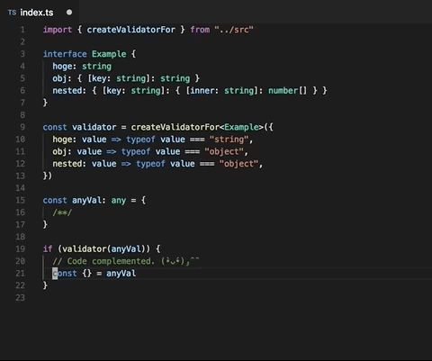

# validate-{TS}

> The object validator for TypeScript.



## Install

`npm install @mironal/validate-ts`

## Usage

```ts
interface Example {
  n: number
  s: string
  b: boolean
  obj: { [key: string]: string }
  nested: { [key: string]: { [inner: string]: number[] } }
}

const validator = createValidatorFor<Example>({
  n: value => typeof value === "number",
  s: value => typeof value === "string",
  b: value => typeof value === "boolean",
  obj: value => typeof value === "object",
  nested: value => typeof value === "object",
})

const anyVal = {/**/}
try {
    if (validator(anyVal)) {
        // If the verification succeeds, code completion becomes possible.
    }
} catch (e) {
    // Or an exception is thrown.
    console.error(e)
}
```

### Recommended to use

We recommend that you use [@sindresorhus/is](https://github.com/sindresorhus/is) to write validator more easily.

```ts
const is = require('@sindresorhus/is')

const validator = createValidatorFor<Example>({
  n: value => is.number,
  s: value => is.string,
  b: value => is.boolean
  obj: value => is.object,
  nested: value => is.object,
})
```

## TODO

- [ ] more test
- [ ] more useful functions
  - compose validator